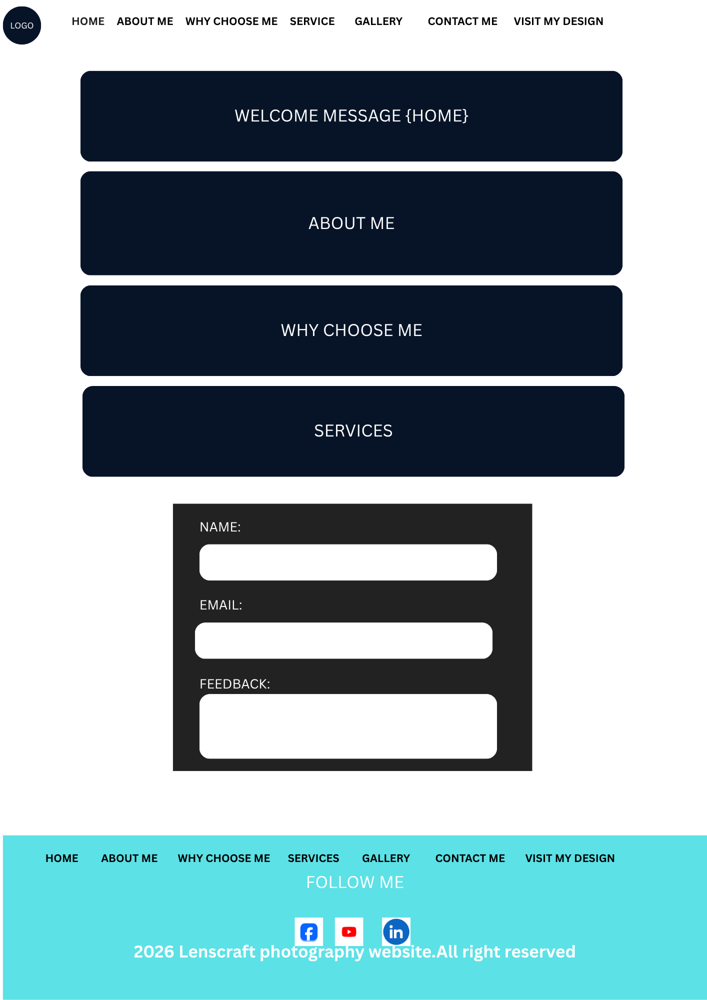

# LensCraft Photography Website

## Author

Julius Kirima

---

## Project Description

LensCraft Photography is a simple photography portfolio website built using HTML and CSS.

The website allows visitors to:

- Learn about the photographer.
- View photography collections.
- Browse the gallery.
- Contact the photographer.

This project was created as part of my HTML and CSS learning journey.

---

## Website Design

Before I started building the website, I created a simple design to plan the layout and sections.

The design can be found below.



---

## Features

- Home page
- About Me section
- Why Choose Me section
- Photography Services
- Gallery page
- Contact form
- Responsive layout
- Footer with navigation and social links

---

## Technologies Used

- HTML5
- CSS3
- Git
- GitHub Pages

---

## Project Setup

1. Clone the repository.

```
git clone https://github.com/kirima-julius/LENSCRAFT-PHOTOGRAPHY-WEBPAGE.git
```

2. Open the project folder.

3. Open **index.html** in your web browser.

---

## Live Website

#github pages
https://kirima-julius.github.io/LENSCRAFT-PHOTOGRAPHY-WEBPAGE/

#Netlifly
https://lenscraft-photography-webpage.netlify.app/

---

## Project Structure

```
LENSCRAFT-PHOTOGRAPHY-WEBPAGE/

│── css/
│── images/
│── index.html
│── gallery.html
│── design.html
│── README.md
│── LICENSE
```

---

## Learning Objectives

This project helped me practice:

- HTML elements
- CSS styling
- Flexbox
- CSS Grid
- Box Model
- Git and GitHub
- GitHub Pages deployment

---

## License

This project is for educational purposes.

---

## Copyright

© 2026 Julius Kirima. All Rights Reserved.